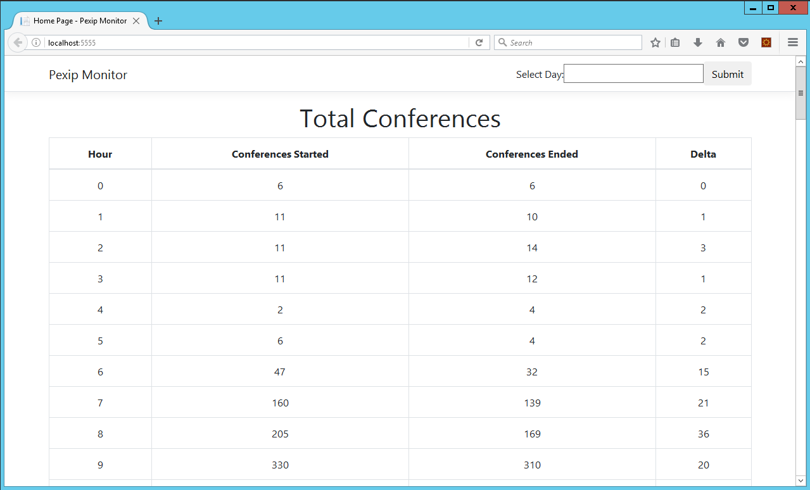
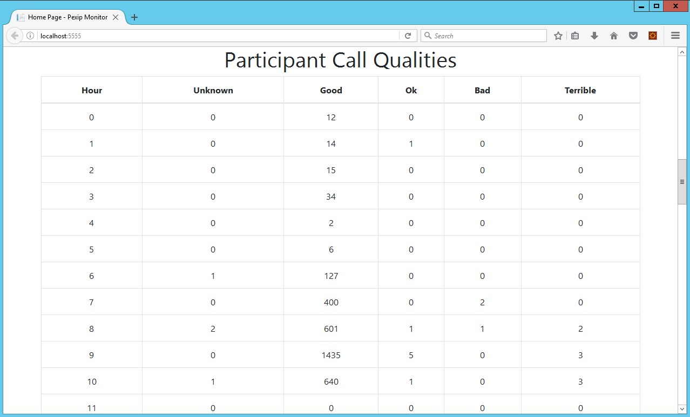
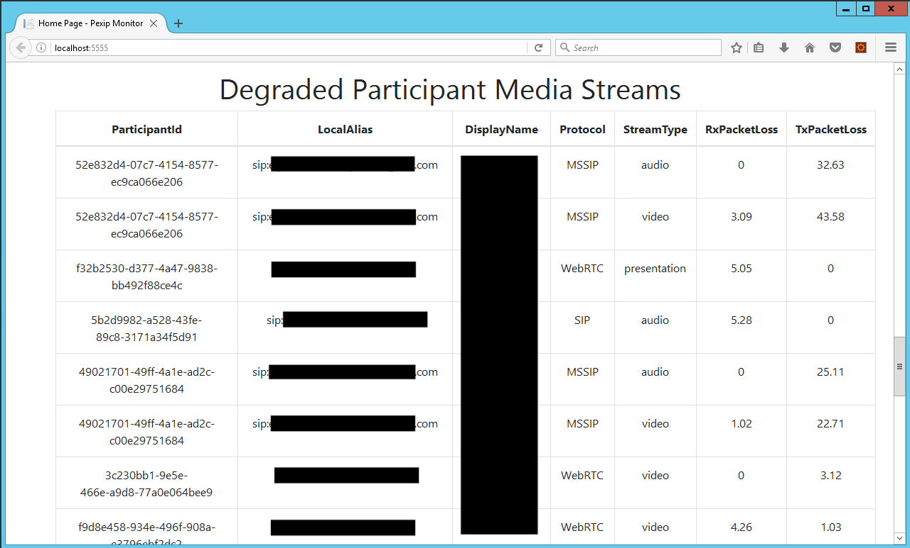

# Pexip.Monitoring

Pexip.Monitoring is a .Net Core solution consisting of two projects:

- **Pexip.Monitoring.Agent** is a console application which communicates with the Pexip Infinity API and writes response data to a SQLite database. Specifically the Pexip [Management history API](https://docs.pexip.com/api_manage/api_history.htm) is used to collect:
  - conference history data
  - participant history data
  - participant media statistics data
- **Pexip.Monitoring.Web** is a ASP.NET Core application which represents the data saved by the Agent. It outputs:
  - the total conferences started and ended per hour for a 24 hour period (selectable)
  - the total call qualities per hour for a 24 hour period (selectable)
  - media streams that exceed a configurable packet loss percentage threshold for a 24 hour period (selectable)

# Installation

## Agent Installation

The agent depends on the Pexip.Lib project found here [Pexip.Lib](https://github.com/jasonneurohr/Pexip.Lib)

**Create the database:**

- Refer to [Getting Started with EF Core on ASP.NET Core with a New database](https://docs.microsoft.com/en-us/ef/core/get-started/aspnetcore/new-db?tabs=visual-studio)

**Deploy the agent:**

- Publish the project
- Deploy the published project to your desired host, e.g. a Windows Server with the .Net Core Hosting package installed
- Update the appsettings.json with the required details, noting **historyHours** determines how far back from the point in time the agent is executed that it will request data from the Pexip API. 

```json
{
  "dbPath": "Path to the Pexip SQLite DB",
  "pexipManager": {
    "address": "FQDN of the Pexip Manager",
    "username": "Username of the Pexip Manager admin",
    "password": "Password for the Pexip Manager admin"
  },
  "historyHours": 2,
  "logFilePath": "Path to the text file log"
}
```

- Set up a Windows Scheduled Task or Linux cron job to execute the agent at the desired intervals

## Web Installation

Refer to [Host and deploy ASP.NET Core](https://docs.microsoft.com/en-us/aspnet/core/host-and-deploy/?view=aspnetcore-2.2) for your specific deployment needs.

- Publish the project and deploy to your desired host, e.g. a Windows Server with the .Net Core Hosting package installed
- Update the appsettings.json with the required details

```json
{
  "ConnectionStrings": {
    "DefaultConnection": "Data Source=Path to the Pexip SQLite DB"
  },
  "Logging": {
    "LogLevel": {
      "Default": "Warning"
    }
  },
  "AllowedHosts": "*",
  "Configuration": {
    "PacketLossThresholdPercentage": 3,
    "FilterList": [
      "Endpoint One",
      "Endpoint Two"
    ]
  }
}
```

# Usage

Once the installation has been completed successfully simply browse to the web interface at the location it was deployed to. Information for the current day is displayed by default. To view information from alternate days use the date box in the top right corner.







# License

Pexip.Monitoring is Open Source software and is released under the [Apache license 2.0](https://github.com/jasonneurohr/Pexip.Monitoring/blob/master/LICENSE)